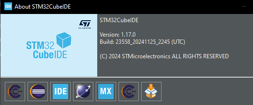
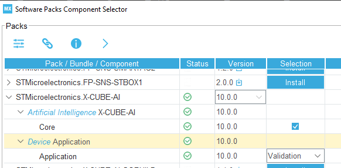
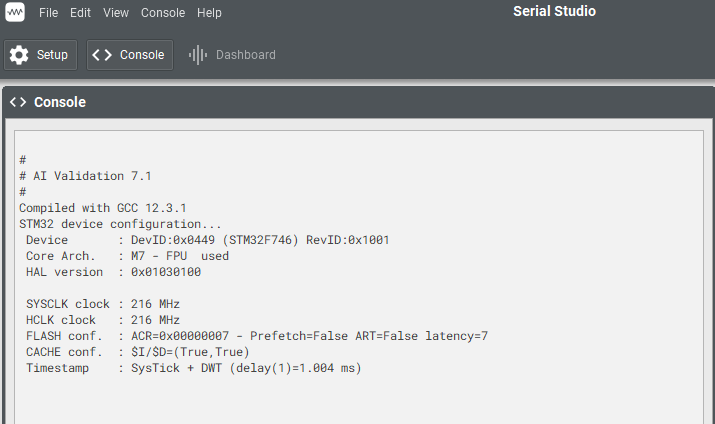
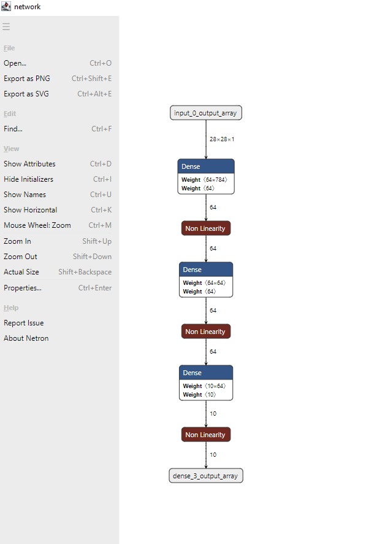

# AI Handwriting Recognition on STM32F746G-DISCO

This project implements AI-based handwriting recognition on the STM32F746G-DISCO board.
It is based on the repository:

- [Source YouTube Demonstration](https://www.youtube.com/watch?v=0QSbi8sorVI)
- [Source GitHub Repository](https://github.com/jhang-jhe-wei/AI-handwriting-recognition-based-on-STM32f746g-DISCOVERY)

### Differences from the Original Project
- The project is compiled using **STM32CubeIDE** instead of the original toolchain.
- More recent versions of libraries and dependencies have been used.
- STM32CubeMX regeneration does not cause any issues.
- **MPU (Memory Protection Unit) settings were not configured through CubeMX.**
---

